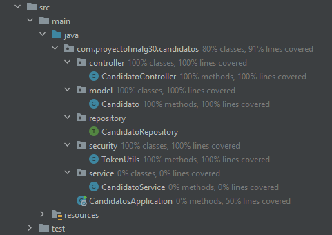
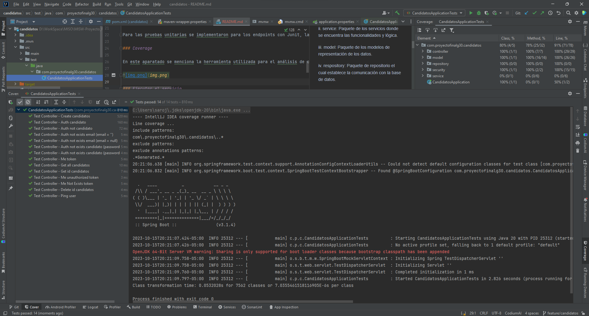
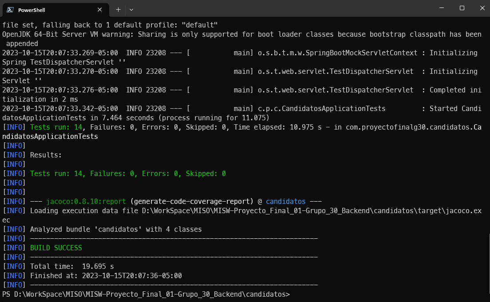
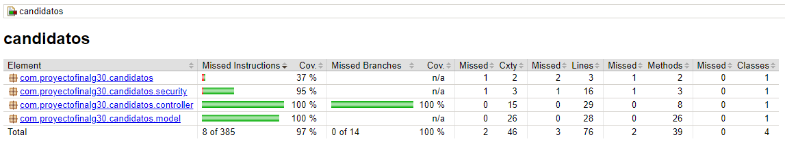

# Microservicio candidatos

### Esquema del repositorio

Dentro de las carpetas src/main/java/com/proyectofinalg30/candidatos se encuentra la distribución de los componentes de la API, dividiendo el mismo en capas como buena práctica, teniendo los siguientes paquetes:

i. controller: Paquete de los controladores que cuenta con los endpoint.

ii. service: Paquete de los servicios donde se encuentra las funcionalidades y lógica.

iii. model: Paquete de los modelos de representación de los datos.

iv. respository: Paquete de repositorio el cual establece la comunicación con la base de datos.

v. security: Paquete de seguridad que contiene la configuración de Authentication y Authoritation.

Para los recursos de pruebas unitarias se podrá encontrar desde la siguiente ruta src/test/java/proyectofinalg30/candidatos allí se listarán las pruebas por cada controller existente, en nuestro caso 1 archivos con 14 escenarios.

### Pruebas unitarias

Para las pruebas unitarias se implementaron para los endpoints con Junit, la ejecución de pruebas se puede realizar ubicándose en la raíz del proyecto y ejecutando el siguiente comando. mvn test.

### Coverage

En este aparatado se menciona la herramienta utilizada para el análisis de coverage del codigo jacoco, y que una ves ejecutado el comando mvn test podrá acceder al reporte que se muestra a continuación. Esta mimas es utilizada para evaluar el coverage en el Action de GitHub.

### Ejecutar el servicio

Para ejecutar el jar usted debe posicionarse en la siguiente ruta /proyectofinalg30/candidatos/target y ejecutar el comando java -jar Prueba-Tecnica-INTCOMEX-0.0.1-SNAPSHOT, para esto el equipo debe contar con el JDK 19 o el OpenJDK.

Si desea compilar nuevamente el jar usted se debe posicionarse en la raíz del proyecto y ejecutar el comando mvn install y este se alojará en la ruta mencionada anteriormente /Prueba-Tecnica-INTCOMEX/target

Puerto configurado es el 8080, por lo que la ruta sería la siguiente http:/localhost:8080/.